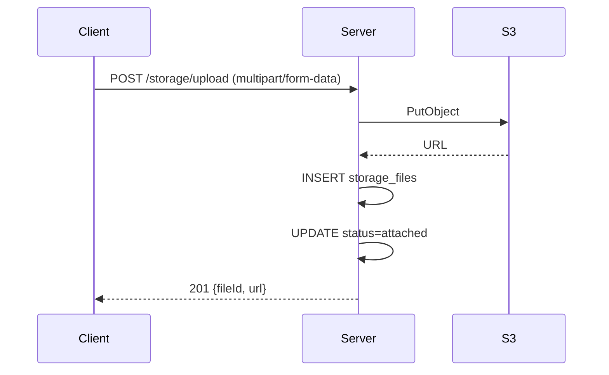
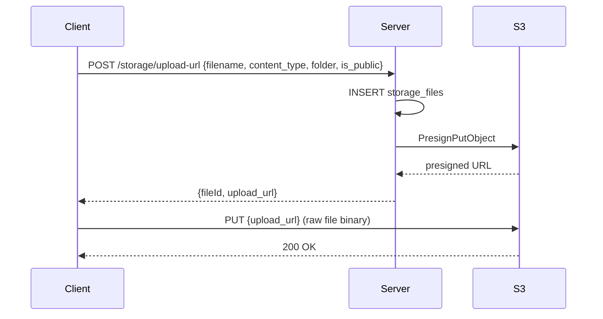
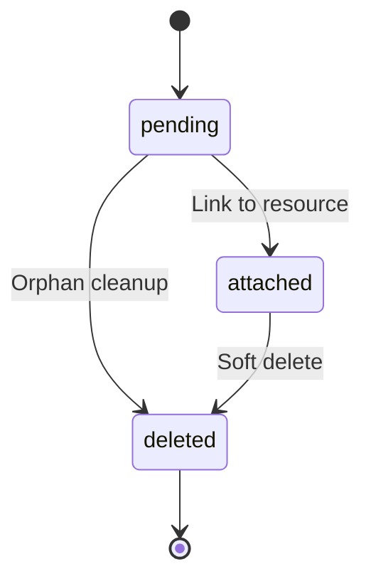

# Storage Upload Flow

## Overview

Storage is a cross-cutting integration that provides file upload, presigned URL, and delete operations via S3-compatible object storage. It is used by domain modules (e.g. enrollment for payment proof uploads) through the `IStorageService` contract.

## Architecture

```
contracts/integration/storage.contract.ts   ← IStorageService interface
contracts/storage.contract.ts               ← IStorageRepo interface (file lifecycle)
integrations/storage/                       ← S3 implementation (upload, presign, delete)
integrations/storage/client.ts              ← S3 client factory + config
integrations/index.ts                       ← createStorageService() factory
modules/storage/                            ← Storage module (usecase + repo + handler)
modules/storage/storage.index.ts            ← Composition root + Hono router
```

Dependencies flow inward: **Handler → Usecase → IStorageService (interface) + IStorageRepo (interface)**. The concrete implementations are wired at the module composition root.

## Contract

### IStorageService (Integration)

```typescript
// src/contracts/integration/storage.contract.ts

interface IStorageService {
  upload(req: UploadFileReq): Promise<UploadFileRes>
  presignUpload(req: PresignUploadReq): Promise<PresignUploadRes>
  getPresignedUrl(key: string, expiresIn?: number): Promise<string>
  delete(key: string): Promise<void>
}
```

### IStorageRepo (Repository)

```typescript
// src/contracts/storage.contract.ts

interface IStorageRepo {
  create(req: CreateStorageFileReq): Promise<StorageFile>
  findById(id: string, companyId: string): Promise<StorageFile | null>
  findByObjectKey(objectKey: string, companyId: string): Promise<StorageFile | null>
  markAttached(id: string, companyId: string): Promise<void>
  markDeleted(id: string, companyId: string): Promise<void>
  getExpiredPending(before: Date, limit: number): Promise<StorageFile[]>
}
```

## Upload Paths

### Path A: Server-Side Direct Upload

The server receives the file binary, uploads it directly to S3, and saves the resulting URL.



**When to use:** Simple admin/internal flows, small files, trusted clients.

**API:** `POST /api/storage/upload`

### Path B: Presigned Upload URL

The server creates a DB record, generates a presigned PUT URL, and returns it to the client. The client uploads directly to S3, then the server marks the file as attached.



**When to use:** Mobile apps, large files, flows where file must be tracked before attachment.

**API:** `POST /api/storage/upload-url`

## File Lifecycle



| Status | Meaning | Deletable? |
|---|---|---|
| `pending` | DB record created, presigned URL issued, file uploaded but not yet linked | Yes |
| `attached` | Linked to a business resource | No |
| `deleted` | Soft-deleted (deletedAt set) | — |
| `failed` | Terminal error state | — |

## Object Key Structure

```text
{visibility}/{companyId}/{folder}/{timestamp}-{sanitizedFilename}

Examples:
  private/comp-123/uploads/1707000000000-receipt.pdf
  private/comp-123/payment-proofs/1707000000000-proof.jpg
  public/comp-123/logos/1707000000000-logo.png
```

## API Endpoints

| Method | Path | Description |
|---|---|---|
| `POST` | `/api/storage/upload` | Direct file upload |
| `POST` | `/api/storage/upload-url` | Get presigned upload URL |
| `DELETE` | `/api/storage/:id` | Delete file (pending only) |
| `GET` | `/api/storage/:id/url` | Get presigned download URL |
| `POST` | `/api/storage/cleanup` | Cleanup expired pending files |

## Wiring Into a Module

To add storage to any module:

### 1. Inject via composition root

```typescript
// modules/<name>/<name>.index.ts

import { createStorageService } from '@/integrations'

const storage = createStorageService()
```

### 2. Use in usecase

```typescript
// modules/<name>/<name>.usecase/upload-proof.ts

export async function uploadProof(deps, req) {
  const result = await deps.storage.upload({
    key: `payment-proofs/${req.companyId}/${req.id}/${req.filename}`,
    body: req.file,
    contentType: req.contentType,
  })
  return deps.repo.update({ id: req.id, proofUrl: result.url })
}
```

## Testing

Unit tests mock `IStorageService` and `IStorageRepo` directly:

```typescript
import { mock } from 'bun:test'

const storage = {
  upload: mock(() => Promise.resolve({ url: 'https://s3.example.com/file.pdf', key: 'test' })),
  presignUpload: mock(() => Promise.resolve({ url: '', key: '', method: 'PUT', headers: {} })),
  getPresignedUrl: mock(() => Promise.resolve('')),
  delete: mock(() => Promise.resolve()),
}

const repo = {
  create: mock(() => Promise.resolve({ id: 'file-1', ... })),
  findById: mock(() => Promise.resolve({ id: 'file-1', status: 'pending', ... })),
  markAttached: mock(() => Promise.resolve()),
  markDeleted: mock(() => Promise.resolve()),
  getExpiredPending: mock(() => Promise.resolve([])),
}
```

## Environment Variables

```bash
# S3 Configuration
S3_BUCKET=your-bucket-name
S3_REGION=ap-southeast-1
S3_ACCESS_KEY_ID=your-access-key
S3_SECRET_ACCESS_KEY=your-secret-key
S3_ENDPOINT=https://s3.ap-southeast-1.amazonaws.com  # optional, for custom endpoints (MinIO, etc.)
S3_PUBLIC_BASE_URL=https://your-bucket.s3.amazonaws.com  # optional, for public file URLs
```

## Files

| File | Purpose |
|---|---|
| `src/contracts/integration/storage.contract.ts` | IStorageService interface |
| `src/contracts/storage.contract.ts` | IStorageRepo interface + StorageFile entity |
| `src/integrations/storage/client.ts` | S3 config + client factory |
| `src/integrations/storage/upload.ts` | Direct upload to S3 |
| `src/integrations/storage/presign.ts` | Presigned PUT and GET URL generation |
| `src/integrations/storage/delete.ts` | S3 object deletion |
| `src/integrations/storage/index.ts` | StorageIntegration class (thin wrapper) |
| `src/integrations/index.ts` | Factory function (createStorageService) |
| `src/db/schema/tables/storage_file.ts` | storage_files table schema |
| `src/db/schema/enums.ts` | file_status enum |
| `src/modules/storage/storage.repo.ts` | Storage repo barrel |
| `src/modules/storage/storage.repo/*.ts` | Individual repo operations |
| `src/modules/storage/storage.usecase.ts` | Storage usecase barrel |
| `src/modules/storage/storage.usecase/*.ts` | Individual usecase functions |
| `src/modules/storage/storage.handler.ts` | Handler barrel |
| `src/modules/storage/storage.handler/*.ts` | Individual HTTP handlers |
| `src/modules/storage/storage.schema.ts` | Zod validation schemas |
| `src/modules/storage/storage.index.ts` | Composition root + Hono router |

## Reference

- artisancode/backend storage flow: `docs/flow/storage_upload_flow.md`
- artisancode storage core: `internal/core/storage/`
- artisancode S3 integration: `internal/integration/storage/`
